# Locking System Using ESP32 Embedded Controller

#### In today's fast-paced world, the demand for smart security systems has surged, leading to the development of more efficient and reliable solutions for home and office security. One such system is the ESP32-based Locking System, which offers a modern, internet-connected approach to controlling access. The ESP32, a versatile and powerful embedded controller, serves as the core component for this project, enabling remote management of locks via the Telegram app.

#### The ESP32 microcontroller is equipped with Wi-Fi and Bluetooth capabilities, making it ideal for IoT (Internet of Things) applications. By leveraging its Wi-Fi connectivity, the system can be controlled remotely through a Telegram bot, offering users a convenient and secure way to lock or unlock doors from anywhere in the world. This system not only adds a layer of convenience but also provides the ability to track and control access in real-time.

#### This project offers a blend of embedded systems, IoT, and user-friendly app control, creating an innovative solution to traditional security systems. The use of Telegram as the interface enhances the system's usability, as it leverages an app that is already widely used and familiar to many. Moreover, it enhances security by enabling access control via a secure communication channel.

## IMPLEMENTATION
The implementation of the ESP32-based Locking System using the Telegram app involves both hardware and software components. The project will consist of the following key stages:
-  Hardware Setup
-  Software Development
-  Telegram Bot Configuration
-  Integration and Testing

### Hardware Setup

<h3><b>(a) Components Needed:</b></h4>

-  <b>ESP32 Microcontroller : </b>The ESP32 is the central processing unit of the system, responsible for handling communication between the user and the lock mechanism. It connects to a Telegram bot for remote access, allowing users to lock/unlock the system via a chat interface.
Features of ESP32:
    *    Built-in Wi-Fi and Bluetooth for wireless control.
    *    Multiple GPIO pins for interfacing with peripherals.
    *    Low power consumption, suitable for IoT applications.
    *    Can integrate with cameras for additional security (e.g., ESP32-CAM).
    
 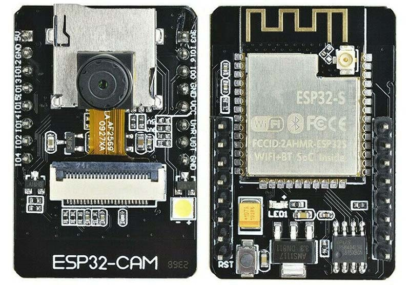

-  <b>Servo Motor or Electronic Lock : </b>The locking mechanism can be implemented using either a servo motor or an electronic solenoid lock.
    *    Servo Motor (for Physical Locking)
Moves between angles (e.g., 0° and 90°) to control a latch.Can be powered directly by the ESP32 or an external supply.
    *    Electronic Solenoid Lock
Uses electromagnetism to control a locking bolt.Requires higher voltage (typically 12V), needing a relay for safe ESP32 control.
    
 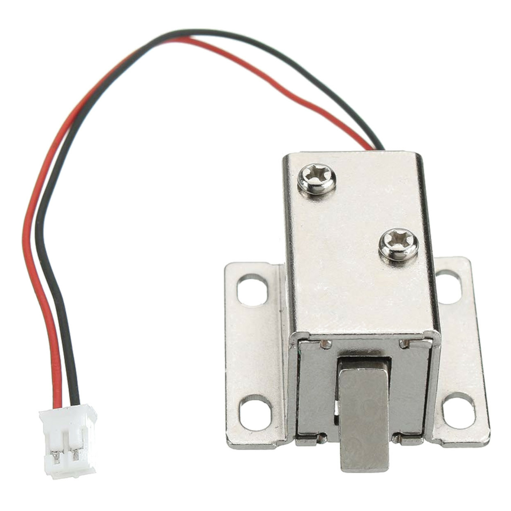
    
-  <b>Power Supply : </b>A proper power source is needed to run both the ESP32 and the locking mechanism.
Power Requirements:
    *    ESP32 → 3.3V or 5V (USB power or regulated power supply).
    *    Servo Motor → Typically 5V (depending on the model).
    *    Solenoid Lock → Usually 12V, requiring an external power supply.
    
 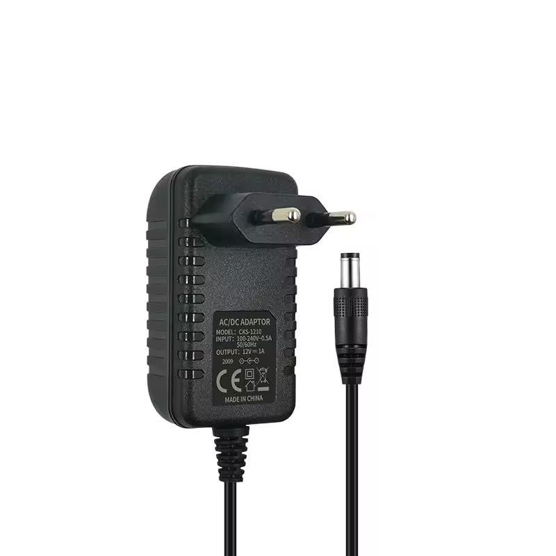
    
-  <b>Jumper Wires and Breadboard :</b> For wiring the components together.  
    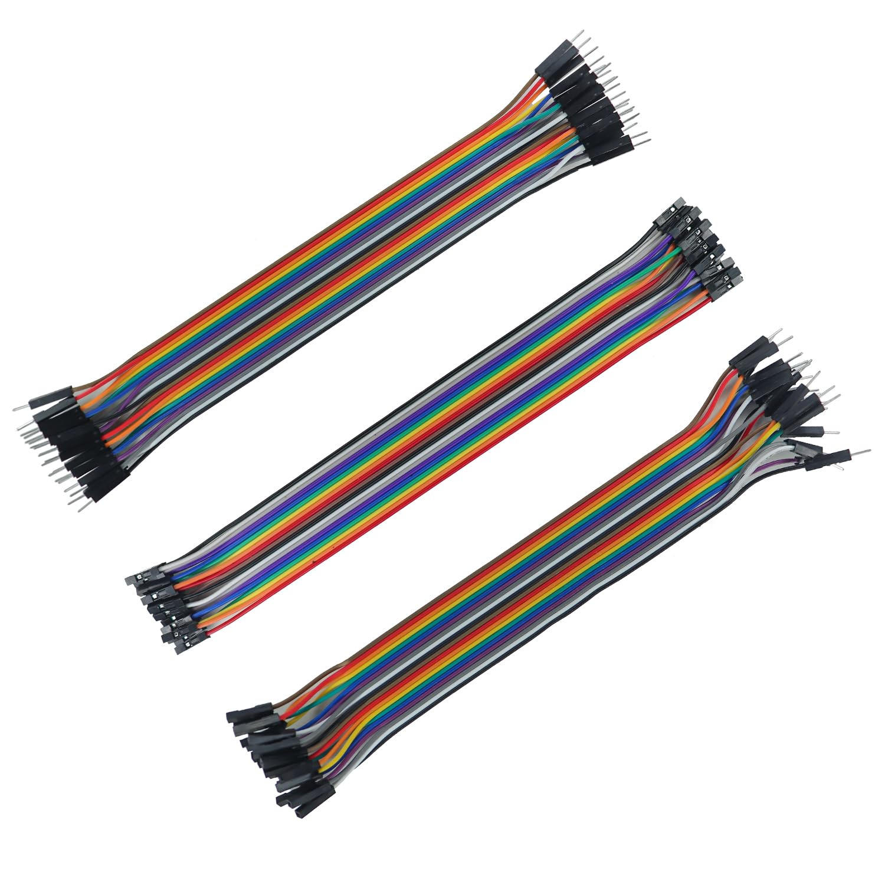 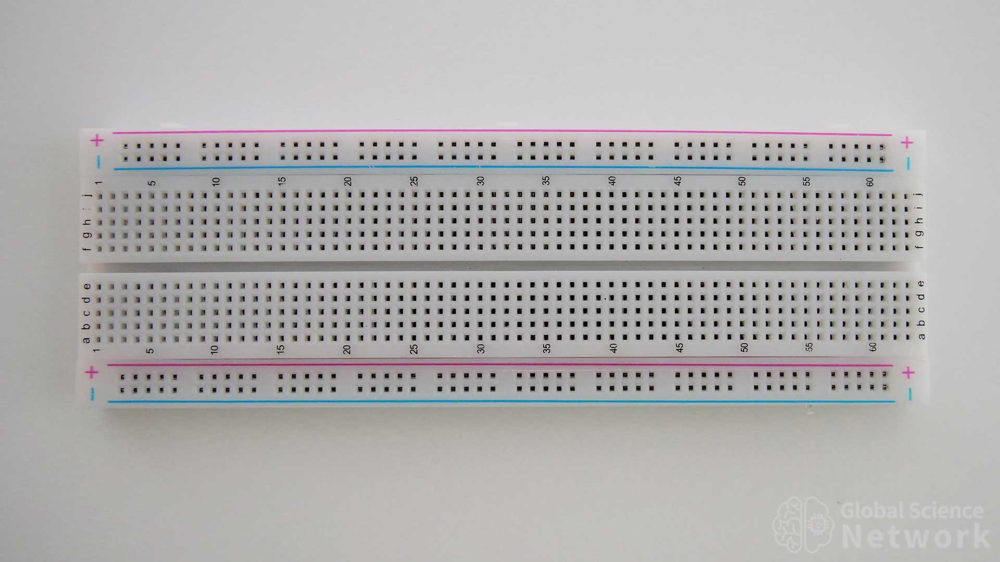
    
-  <b>Relay Module (if needed) :</b> A relay module is needed when working with high-power components, such as a 12V solenoid lock, to safely switch power using the ESP32.
    *    Why Use a Relay?
            ESP32 operates at 3.3V logic, whereas a solenoid lock requires 12V.

Prevents direct connection, ensuring safety and longevity.
- <b> Resistors and Capacitors :</b> These may be needed for additional components or to stabilize power to the ESP32 or locking mechanism.

<h4>(b) Basic Circuit Diagram:</h4>

<h3><b>Block Diagram</b></h3>

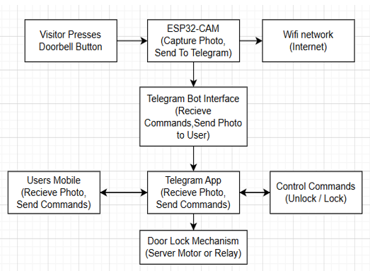
<h3><b>Circuit Diagram</b></h3>

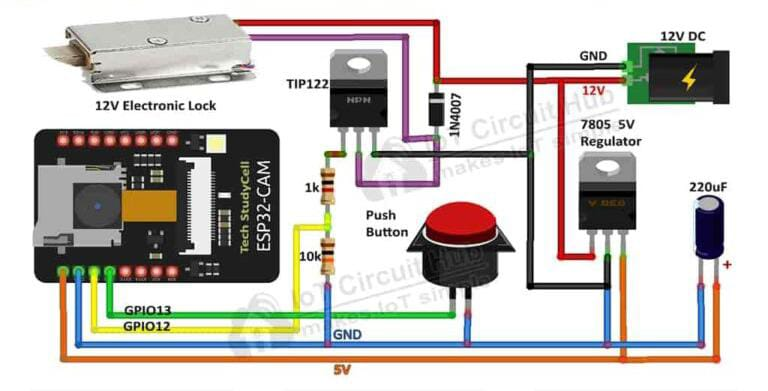
<h3><b>Pin Diagram</b></h3>

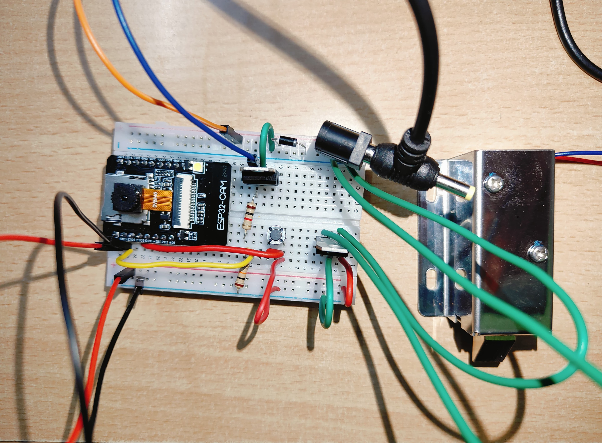

-  The ESP32 will be connected to the relay or servo motor to control the locking mechanism.
-  The GPIO pins of the ESP32 will be used to send signals to the servo motor or relay.
-  A button or magnetic sensor can be added for local manual control of the locking system (optional).

### Software Development
<h4>(a) Programming Environment:</h4>

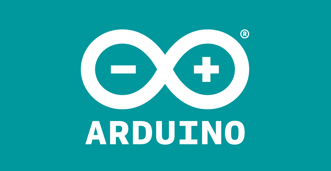

Arduino IDE: The ESP32 can be programmed using the Arduino IDE. The IDE allows you to write, compile, and upload the code to the ESP32 board.

<h4>(b) Libraries Required:</h4>

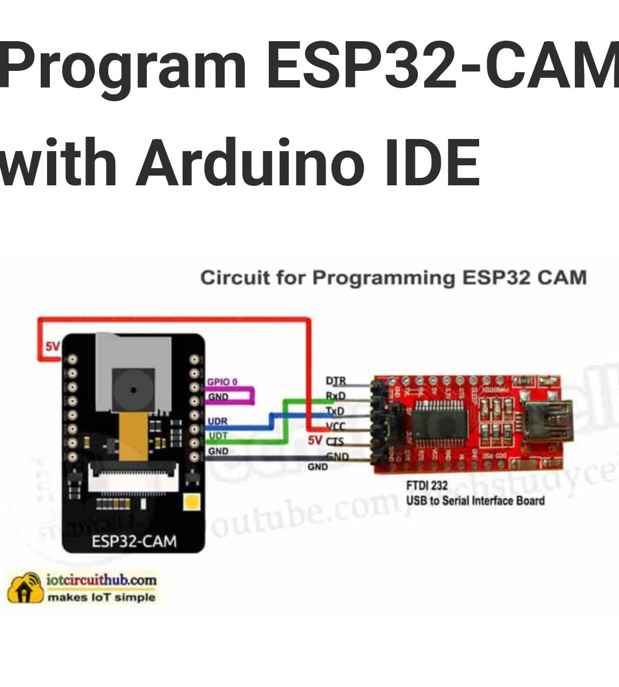

- WiFi.h: For connecting the ESP32 to Wi-Fi.
- UniversalTelegramBot.h: A library for communicating with the Telegram Bot API.
- Servo.h (if using a servo motor): For controlling the servo motor.
- ArduinoJson.h: For parsing JSON data from the Telegram bot.

### Telegram Bot Configuration
To control the lock via the Telegram app, you'll need to set up a Telegram Bot :

<h4>(a) Create a new Telegram Bot:</h4>

 

-  Open the Telegram app and search for the “BotFather.”
-  Use the command /newbot to create a new bot.
-  You’ll receive an API token for your bot. Save this token as you will need it in your code.

<h4>(b) Obtain Your Chat ID:</h4>

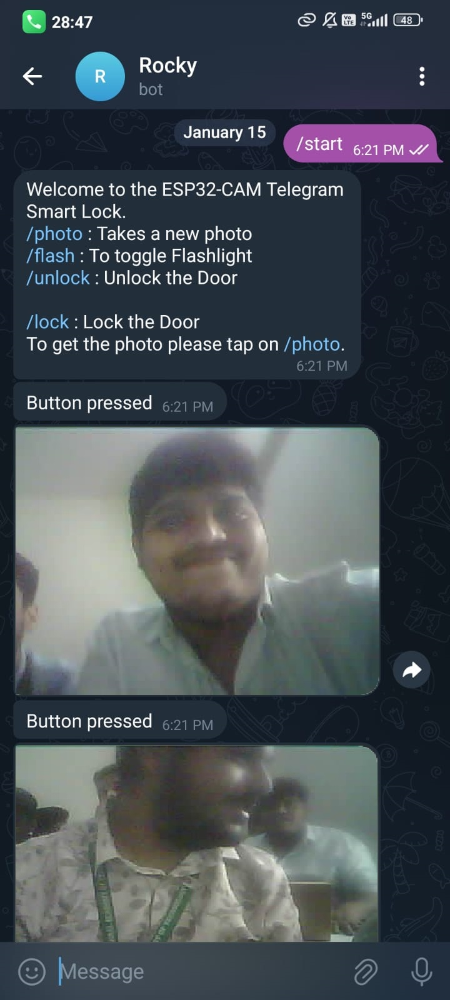

-  Start a conversation with your bot in Telegram.
-  Use a bot like [@userinfobot] (https://t.me/userinfobot) to find your Chat ID. You’ll need this ID to send messages to your specific user.

### Integration and Testing
Once the hardware is assembled and the software is loaded onto the ESP32, the system needs to be tested to ensure functionality:
-  Connect the ESP32 to Wi-Fi : Verify the ESP32 can connect to your network.
-  Test the Lock/Unlock Mechanism : Ensure the servo motor or relay activates correctly in response to commands sent from the Telegram bot.
-  Test Telegram Commands : Send /lock and /unlock commands to the Telegram bot to verify the ESP32 responds appropriately, locking and unlocking the door.

<b>
</b>

## RESULTS
The implementation of the ESP32-based Locking System controlled through the Telegram app results in several key outcomes, which demonstrate the effectiveness and practicality of the solution. Below are the key outcomes of the system:

<h4>(a) Remote Access Control:</h4>

One of the primary outcomes of this system is the ability to control the locking mechanism remotely, from anywhere with an internet connection. By leveraging the ESP32’s Wi-Fi capabilities and the Telegram messaging app, users can lock or unlock doors without being physically present. This outcome is especially beneficial for:
-  Homeowners : Granting access to family members, friends, or service personnel without the need to provide physical keys.
-  Businesses/Offices : Granting temporary access to employees or visitors without being physically on-site, improving the flexibility and security of office premises.

<h4>(b) Improved Security and Convenience:</h4>

The system eliminates the need for traditional keys, which can be lost, duplicated, or stolen. Instead, digital communication via the Telegram bot ensures secure access management. This outcome significantly enhances security by:

-  Providing a traceable record of access (e.g., who locked/unlocked the door and when).
-  Enabling instant notifications when the door is locked/unlocked, improving monitoring.
-  Password-less authentication : The Telegram app acts as the authentication layer, with only authorized users able to control the lock via their Telegram credentials.

Additionally, the convenience of controlling access via a familiar mobile app (Telegram) enhances the user experience, ensuring the system is easy to use and doesn’t require additional hardware or software.

## ACKNOWLEDGEMENT
<b>I would like to express my heartfelt gratitude to Global Academy of Technology for providing the platform and resources necessary for the successful completion of this project.

I extend my sincere appreciation to my project guide, Shazia Sulthana Ma’am, for her invaluable guidance, encouragement, and continuous support throughout this journey. Her expertise and insights have been instrumental in shaping my understanding and execution of the project.

I also wish to thank IOT CIRCUIT HUB for offering a comprehensive understanding of IoT and embedded systems. Their resources and support have greatly enhanced my knowledge and helped me implement the project effectively. Here's the [link](https://iotcircuithub.com/esp32-cam-telegram-wifi-door-lock/).

Lastly, I am deeply grateful to my parents for their unwavering support and encouragement, which has been a constant source of motivation throughout this endeavor.

Thank you all for your immense support and guidance!
</b>

